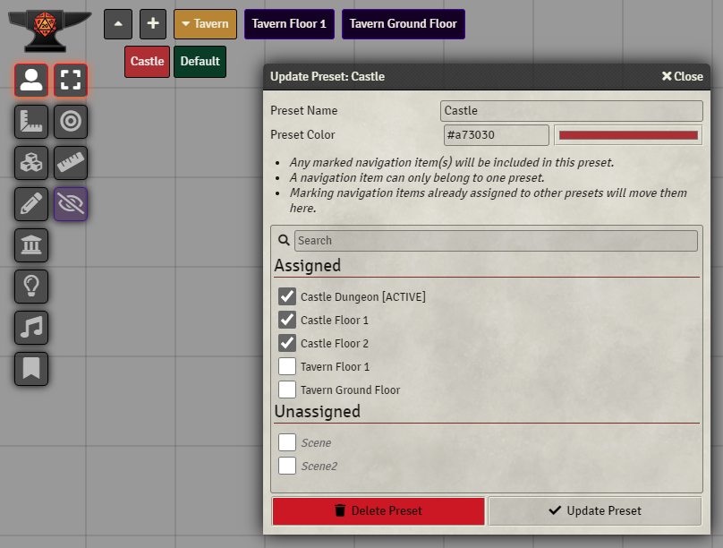

# Navigation Presets

     

This is a module for FoundryVTT which adds configurable presets to the navigation bar

## Instructions
When you first load the module, all navigation items will be added to a default preset called Default.
- The Plus icon in the navigation bar can be used to create a new preset
- By right-clicking any preset you are presented with an Edit option. You can manage navigation item assignments using this

Anyone who has used my Compendium Folders and Macro Folders modules will be familiar with the edit dialog, you are able to assign navigation items to the current preset, and delete the current preset.
Deleting a preset will add all navigation items within that preset to the Default preset.

## Future
1. ~~Show player status in presets (number of players, if a scene is active)~~ Now in v1.0.2
2. Saving open/close state of preset bar
3. Import scene folder structure to presets
4. Nested presets

Any issues feel free to ping me on Discord (@Erceron#0370)

## Contribution
If you'd like to support my work, feel free to buy me a coffee at [my kofi](https://ko-fi.com/erceron)
